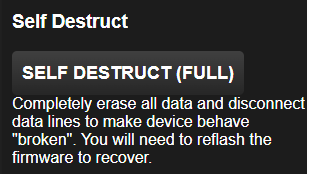
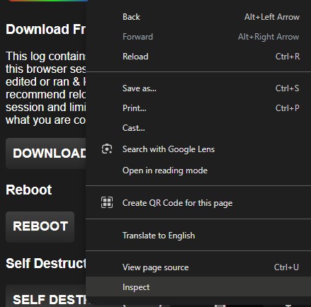
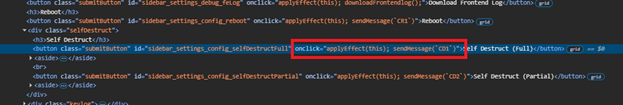
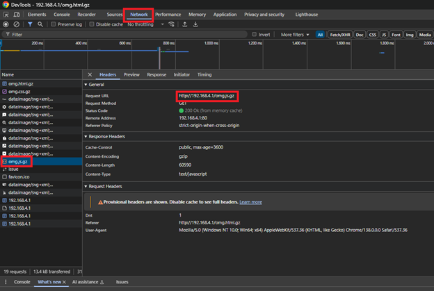
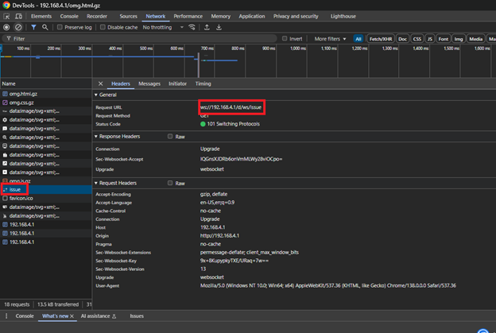
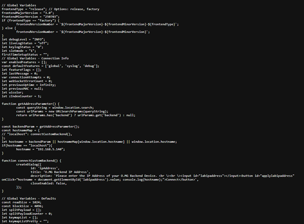
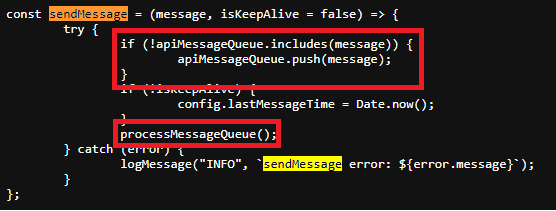
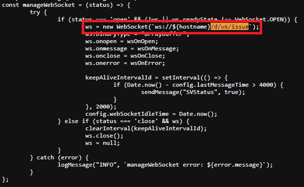
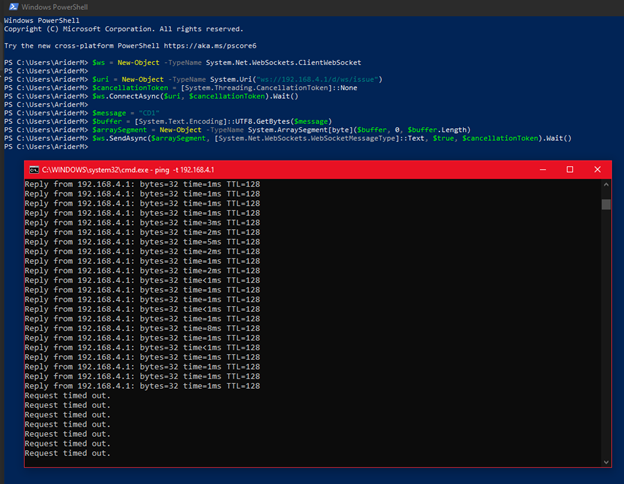

I recently procured an O.MG Elite cable and figured I’d probe the thing and see what the big scare was.

This cable is terrifying if you read the articles and listen to the interviews. It’s a ticking time bomb until a company gets hit by this nefarious but inconspicuous cable. But in a recent interview with \[CHANNEL\] I picked up on a mention from that creator of the cable is okay with it’s existence as the stealth features require meticulous configuration.

So I picked one up and started exploring one out of the box. A major feature for red teams and bad actors is the ability to wipe the cable using 2 methods. One option kills the O.MG aspects, leaving a passthrough USB C cable in place. The second method kills communications between the active and passive end, in the hopes the victim will toss it as a dead cable.

Within the UI of the cable I found the button to kill the cable entirely and this is what it looks like:

I did a bit more digging by inspecting the DOM element:

Which lead me to the JavaScript function call to send a message to the cable:

As I was poking around I came across a few things of interest. I peaked into the Network tab that shows various individual files the server is asking the client to load as well as packets sent to the server. I came upon a JavaScript file the server told the client to load:

Immediately after the JavaScript file I could see the client upgraded a connection to a websocket instead of HTTP. I noted down the URI path for later and moved on:

First was the JavaScript file containing the majority of the code interfacing the client (browser) to the cable (server):

I searched for the function mentioned in the onclick action displayed from the DOM inspection of the self-destruct button. Looking over this function it takes the current message and pushes it into a queue and then tells it to process the new message in the queue:

So I searched for the function call to process the queue and revealed the encoding used to communicate over the socket:

Earlier I noted the client was upgrading a connection to a websocket and did a search for the URI using just the path parameters and came across this:

Using all of this information we now know the web client will open a socket to the cable and issue commands over the socket with UTF-8 encoding. I didn’t see any authentication over this socket and figured I would give it a shot in PowerShell. I’ll replace the variable in the web socket URI with the full address and try to connect. Then send the command found in the original DOM element, “CD1”, and see what happens while keeping a ping to the cable running:

I didn’t capture it here, but Windows even complained about the cable being unrecognized after the kill chain was initiated.

This isn’t a catch all, as this is an O.MG fresh out of the box with stable firmware applied and no changes. There’s no magic bullet for this cable as it can be fully configured. This means the USB Vendor ID can be changed, MAC address, SSID, and the list goes on.

This article aims to demonstrate how to neuter a cable in the field assuming a bad actor didn’t meticulously comb over every setting. There are various methods of detection and remediation but a couple things I recommend noting:

1) I could not find the default USB Vendor ID in any online database. Below I will include a screenshot of what my cable reported to me while setting it up. EDR should potentially block this vendor ID to prevent payloads from having a chance to launch an attack.  
2) Out of box and flashed, the SSID was pretty obvious. If you have the means to have a wifi radio in monitor mode that can keep an eye out and alert on detection of “O.MG” as an SSID there’s a chance to intervene using the default password for the SSID.  
3) I’m not sure if EDR has this built it yet, but measuring keystrokes per second and limiting the USB device sending them could prevent a large number of these attacks. It looks like keystrokes might be missed if rate limited, causing a payload to fail.

Through all of this I’m going to work with my security team to implement a detection / alert / remediation plan for at least all of the out of box defaults for this cable. It’s not perfect, and a skilled bad actor can find a way, but by capturing all of the basics we can elevate our detection beyond the out of box functions of our current NDR.

Out of box USB Vendor ID information:

